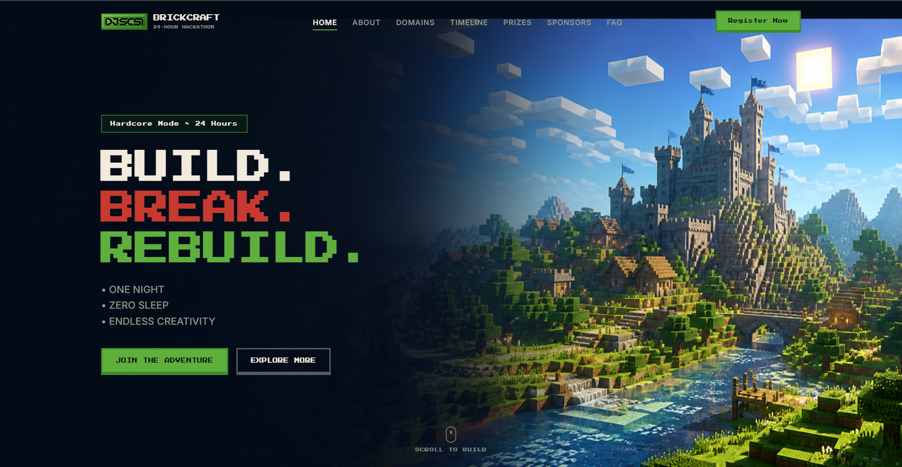
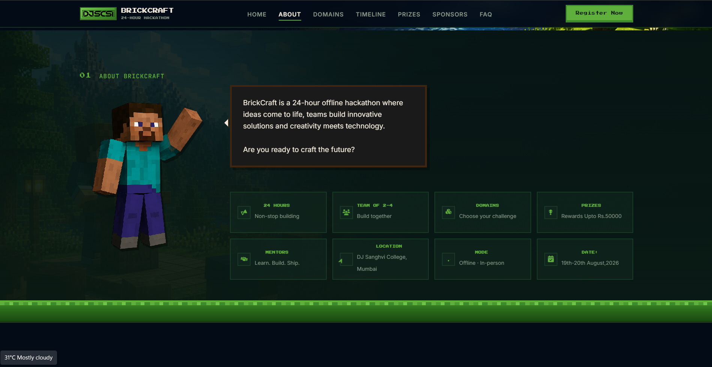
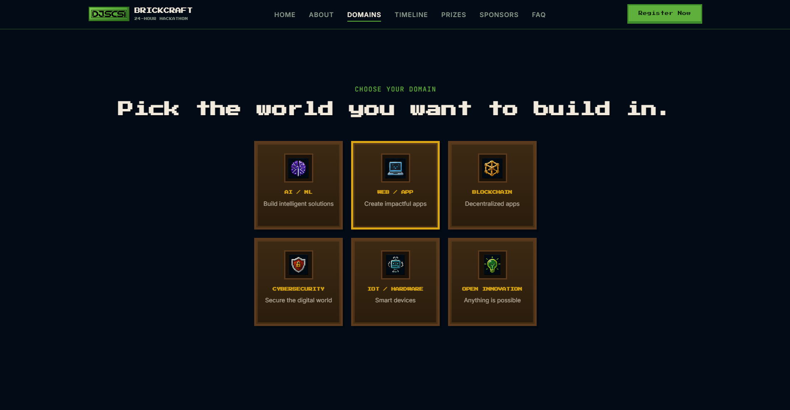
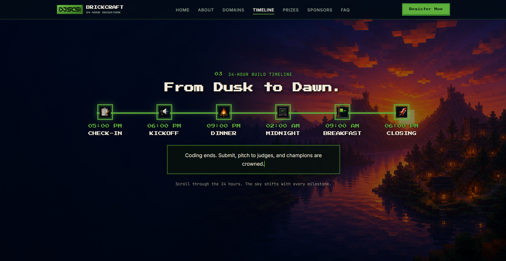
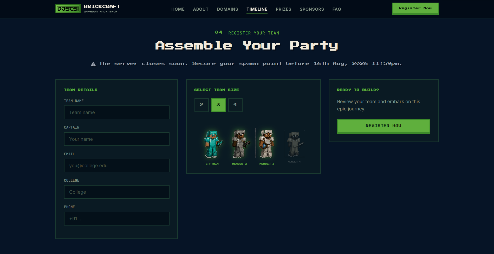
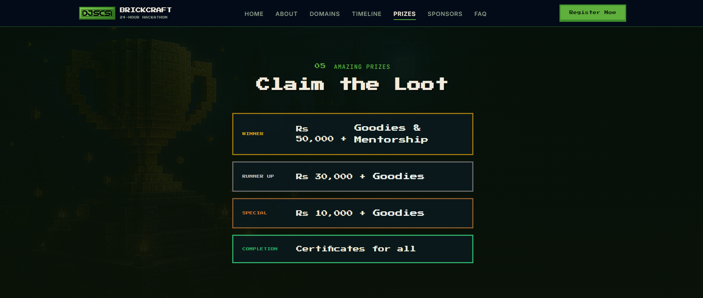
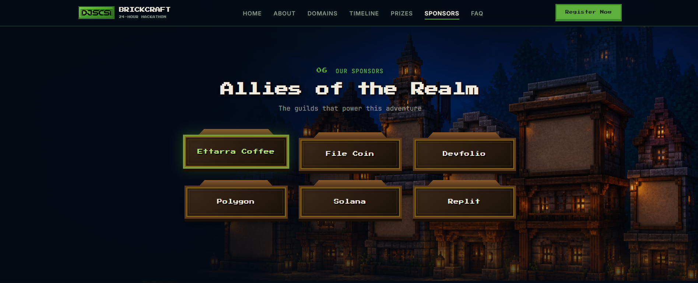
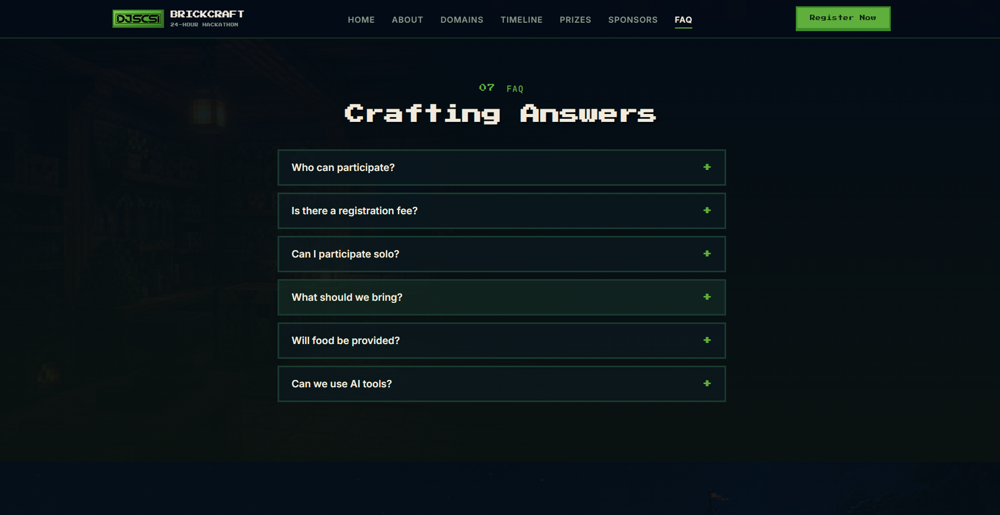
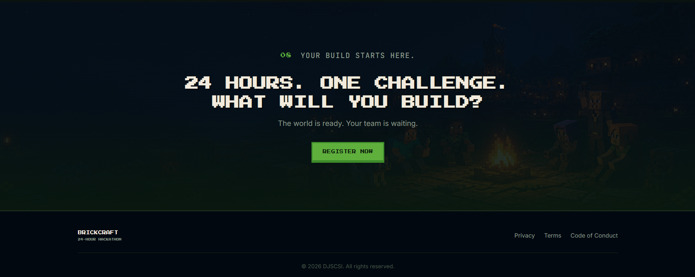

# BrickCraft — 24-Hour College Hackathon

A premium, production-ready landing page for **BrickCraft**, a 24-hour offline DJSCSI hackathon. The site is designed as a continuous journey through a Minecraft-inspired world — professional tech-event branding with pixel aesthetics, scroll storytelling, and purposeful motion.

**Live demo:** [https://djscsi.vercel.app](https://djscsi.vercel.app)

---

## Project overview

BrickCraft is not a generic dark landing page or a game fan site. The experience follows a clear story:

**Enter the world → Meet Steve to know more → Choose your domain → Survive the 24 hours → Build your team → Prizes → Sponsors → FAQs**

Visitors travel through day/sunset/night environments, pick challenge domains, follow a 24-hour timeline, and register their team — all in HTML, CSS, and JavaScript (no 3D engines).

---

## Features implemented

- **Cinematic hero** — Full-viewport Minecraft-style landscape with branding and primary CTAs
- **About section** — Character art, typewriter intro, and feature cards (duration, team size, domains, prizes, mentors, location, mode, date)
- **Domain selection** — Six tracks with custom icons (AI/ML, Web/App, Blockchain, Cybersecurity, IoT/Hardware, Open Innovation)
- **24-hour timeline** — Pinned scroll experience with evening → night → morning → sunset background crossfades and typewriter event descriptions
- **Team registration** — Form + interactive team-size character selector
- **Prizes** — Gold / silver / bronze / emerald (participation) tiers
- **Sponsors** — Village-style sign UI over environmental art
- **FAQ** — Accordion answers for participants
- **Final CTA + footer** — Closing campfire scene and links
- **Responsive layout** — Desktop cinematic layout; adapted tablet/mobile (including mobile nav)
- **Motion** — GSAP + ScrollTrigger (pinned sections, reveals, parallax); respects `prefers-reduced-motion`
- **Audio** — Level-up SFX on loader completion (with gesture fallback for browser autoplay policies)
- **Loader** — Branded loading screen before enter

---

## Technologies and libraries used

| Layer     | Stack                                                                                                       |
| --------- | ----------------------------------------------------------------------------------------------------------- |
| Markup    | HTML5 (semantic sections)                                                                                   |
| Styling   | CSS3 (custom properties, grid/flex, responsive)                                                             |
| Logic     | Vanilla JavaScript                                                                                          |
| Animation | [GSAP](https://gsap.com/) 3.x + ScrollTrigger                                                               |
| Scroll    | [Lenis](https://github.com/darkroomengineering/lenis) (optional, disabled when reduced motion is preferred) |
| Icons     | [Font Awesome](https://fontawesome.com/)                                                                    |
| Fonts     | Press Start 2P, Inter, JetBrains Mono (Google Fonts)                                                        |
| Assets    | WebP/PNG environments, characters, icons; MP3 for SFX                                                       |
| Deploy    | Vercel (also works on GitHub Pages / any static host)                                                       |

---

## Setup instructions

### Run locally

1. **Clone the repository**

   ```bash
   git clone <your-repo-url>
   cd <project-folder>
   ```

2. **Serve over HTTP** (required for reliable audio and asset loading — avoid opening `index.html` via `file://`)

   **VS Code:** Right-click `index.html` → _Open with Live Server_

   **Python:**

   ```bash
   python -m http.server 5500
   ```

   **Node:**

   ```bash
   npx serve .
   ```

3. Open **http://localhost:5500** (or the port shown by your server)

### Notes

- Audio may require a user click on some browsers (autoplay policy)
- Prefer `http://localhost` over `file://` for full behavior

---

## Project structure

```text
├── index.html              # Page structure and content
├── styles.css              # Layout, theme, responsive rules
├── app.js                  # Loader, audio, GSAP, interactions
├── assets/
│   ├── audio/              # levelup.mp3, ambient (optional)
│   ├── backgrounds/        # Hero, about, timeline, prizes, sponsors, FAQ, final
│   ├── characters/         # Steve + team member sprites
│   ├── icons/              # Domain icons, favicon
│   └── timeline/           # Timeline node icons
└── README.md
```

---

## Screenshots

| Section  | Preview                                 |
| -------- | --------------------------------------- |
| Hero     | _Add `assets/screenshots/hero.png`_     |
| Domains  | _Add `assets/screenshots/domains.png`_  |
| Timeline | _Add `assets/screenshots/timeline.png`_ |
| Register | _Add `assets/screenshots/team.png`_     |

```markdown









```

---

## Deployment

**Production:** [https://djscsi.vercel.app](https://djscsi.vercel.app)

## Credits & license

- Built for **DJSCSI** college hackathon task
- Visual style inspired by Minecraft aesthetics; artwork and copy are project-specific
- Third-party libraries remain under their respective licenses (GSAP, Lenis, Font Awesome, Google Fonts)

---
